# Diagram Architektury Autentykacji - 10x Cards

## Przepływ autentykacji dla modułu logowania i rejestracji

Poniższy diagram przedstawia szczegółową sekwencję autentykacji w aplikacji 10x Cards, wykorzystującej Astro, React i Supabase Auth.

```mermaid
sequenceDiagram
    autonumber

    participant Browser as Przeglądarka
    participant Middleware as Astro Middleware
    participant API as Astro API
    participant Supabase as Supabase Auth

    Note over Browser,Supabase: SCENARIUSZ 1: Rejestracja nowego użytkownika

    Browser->>Browser: Użytkownik wchodzi na stronę /
    Browser->>Middleware: GET /
    Middleware->>Middleware: Sprawdź cookies sesji
    Middleware->>Browser: Brak sesji - renderuj stronę logowania

    Browser->>Browser: Użytkownik wybiera zakładkę Rejestracja
    Browser->>Browser: Wypełnia formularz email, hasło
    Browser->>Browser: Walidacja kliencka (onBlur)
    Browser->>Browser: Kliknięcie Zarejestruj się

    Browser->>API: POST /api/auth/register<br/>{email, password}
    API->>API: Walidacja danych wejściowych
    API->>Supabase: signUp(email, password)

    alt Rejestracja pomyślna
        Supabase-->>API: Użytkownik i sesja utworzone
        API->>API: Ustaw HTTPOnly cookies<br/>(access_token, refresh_token)
        API-->>Browser: 201 Created<br/>{success, user, message}
        Browser->>Browser: Toast: Konto utworzone!
        Browser->>Middleware: Automatyczne przekierowanie<br/>do /app/generator
        Middleware->>Middleware: Odczytaj cookies, weryfikuj token
        Middleware->>Supabase: getUser(access_token)
        Supabase-->>Middleware: User data
        Middleware->>Middleware: Wstrzyknij user do locals
        Middleware->>Browser: Renderuj stronę /app/generator
    else Email już istnieje
        Supabase-->>API: Error: Email już zarejestrowany
        API-->>Browser: 409 Conflict<br/>{error: Email już istnieje}
        Browser->>Browser: Wyświetl błąd w formularzu
    else Hasło niespełnia wymagań
        Supabase-->>API: Error: Słabe hasło
        API-->>Browser: 422 Validation Error<br/>{error: Hasło za słabe}
        Browser->>Browser: Wyświetl błąd w formularzu
    end

    Note over Browser,Supabase: SCENARIUSZ 2: Logowanie istniejącego użytkownika

    Browser->>Browser: Użytkownik wchodzi na /
    Browser->>Middleware: GET /
    Middleware->>Middleware: Sprawdź cookies sesji
    Middleware->>Browser: Brak sesji - renderuj stronę logowania

    Browser->>Browser: Użytkownik wypełnia formularz logowania
    Browser->>Browser: Walidacja kliencka
    Browser->>Browser: Kliknięcie Zaloguj się

    Browser->>API: POST /api/auth/login<br/>{email, password}
    API->>API: Walidacja danych wejściowych
    API->>Supabase: signInWithPassword(email, password)

    alt Logowanie pomyślne
        Supabase-->>API: Sesja utworzona
        API->>API: Ustaw HTTPOnly cookies<br/>(access_token, refresh_token)
        API-->>Browser: 200 OK<br/>{success, user}
        Browser->>Browser: Przekierowanie do /app/generator
        Browser->>Middleware: GET /app/generator
        Middleware->>Middleware: Odczytaj cookies, weryfikuj token
        Middleware->>Supabase: getUser(access_token)
        Supabase-->>Middleware: User data
        Middleware->>Middleware: Wstrzyknij user do locals
        Middleware->>Browser: Renderuj stronę /app/generator
    else Nieprawidłowe dane logowania
        Supabase-->>API: Error: Invalid credentials
        API-->>Browser: 401 Unauthorized<br/>{error: Nieprawidłowy email lub hasło}
        Browser->>Browser: Wyświetl błąd w formularzu
    else Rate limit przekroczony
        Supabase-->>API: Error: Too many requests
        API-->>Browser: 429 Rate Limit<br/>{error: Zbyt wiele prób}
        Browser->>Browser: Wyświetl błąd rate limit
    end

    Note over Browser,Supabase: SCENARIUSZ 3: Dostęp do chronionej strony

    Browser->>Middleware: GET /app/flashcards
    Middleware->>Middleware: Odczytaj access_token z cookies

    alt Token ważny
        Middleware->>Supabase: getUser(access_token)
        Supabase-->>Middleware: User data
        Middleware->>Middleware: Wstrzyknij user do locals
        Middleware->>Browser: Renderuj chronioną stronę
    else Token wygasł
        Middleware->>Middleware: Odczytaj refresh_token z cookies
        Middleware->>Supabase: refreshSession(refresh_token)

        alt Refresh pomyślny
            Supabase-->>Middleware: Nowa sesja
            Middleware->>Middleware: Zaktualizuj cookies<br/>(nowe tokeny)
            Middleware->>Middleware: Wstrzyknij user do locals
            Middleware->>Browser: Renderuj chronioną stronę
        else Refresh nieudany
            Middleware->>Middleware: Usuń cookies
            Middleware->>Middleware: Ustaw user = null
            Middleware-->>Browser: Redirect 302 do /
        end
    else Brak tokenów
        Middleware->>Middleware: Ustaw user = null
        Middleware-->>Browser: Redirect 302 do /
    end

    Note over Browser,Supabase: SCENARIUSZ 4: Wylogowanie użytkownika

    Browser->>Browser: Użytkownik klika Wyloguj w Sidebar
    Browser->>API: POST /api/auth/logout
    API->>API: Odczytaj access_token z cookies

    alt Token istnieje
        API->>Supabase: signOut()
        Supabase-->>API: Sesja zakończona
    end

    API->>API: Usuń HTTPOnly cookies<br/>(access_token, refresh_token)
    API-->>Browser: 200 OK<br/>{success, message}
    Browser->>Browser: Toast: Zostałeś wylogowany
    Browser->>Browser: Przekierowanie do /
    Browser->>Middleware: GET /
    Middleware->>Middleware: Brak cookies sesji
    Middleware->>Browser: Renderuj stronę logowania

    Note over Browser,Supabase: SCENARIUSZ 5: Próba dostępu jako zalogowany

    Browser->>Middleware: GET / (użytkownik zalogowany)
    Middleware->>Middleware: Odczytaj cookies
    Middleware->>Supabase: getUser(access_token)
    Supabase-->>Middleware: User data
    Middleware->>Middleware: Wstrzyknij user do locals
    Middleware->>Middleware: Strona publiczna + user istnieje
    Middleware-->>Browser: Redirect 302 do /app/generator
    Browser->>Middleware: GET /app/generator
    Middleware->>Browser: Renderuj generator
```



## Kluczowe mechanizmy bezpieczeństwa

### 1. HTTPOnly Cookies

- Access token i refresh token przechowywane w HTTPOnly cookies
- Niedostępne dla JavaScript (ochrona przed XSS)
- SameSite=lax (ochrona przed CSRF)
- Secure flag w produkcji (tylko HTTPS)

### 2. Automatyczne odświeżanie sesji

- Middleware automatycznie odświeża wygasłe tokeny
- Transparentny dla użytkownika
- Maksymalizacja czasu sesji (refresh token: 30 dni)

### 3. Row Level Security (RLS)

- Polityki RLS w PostgreSQL weryfikują user_id z JWT
- Każde zapytanie do bazy automatycznie filtrowane
- Użytkownik widzi tylko swoje dane

### 4. Rate Limiting

- Wbudowany w Supabase Auth
- 6 prób logowania na godzinę na IP
- 5 rejestracji na godzinę na IP
- Automatyczna ochrona przed brute force

### 5. Walidacja dwupoziomowa

- Walidacja kliencka (React) - UX
- Walidacja serwerowa (Supabase) - bezpieczeństwo
- Mapowanie błędów Supabase na przyjazne komunikaty

## Cykl życia sesji

```
Logowanie
  ↓
Utworzenie sesji (Supabase)
  ↓
Zapisanie cookies (access + refresh)
  ↓
Access token ważny 1h
  ↓
Po wygaśnięciu → automatyczne odświeżenie (refresh token)
  ↓
Refresh token ważny 30 dni
  ↓
Po wygaśnięciu → wymagane ponowne logowanie
```

## Komponenty systemu

### Frontend (React)

- `LoginForm` - formularz logowania z walidacją
- `RegisterForm` - formularz rejestracji z walidacją
- `AuthView` - kontener z zakładkami login/register
- `useAuth` (hook) - komunikacja z API, zarządzanie stanem

### Backend (Astro)

- `Middleware` - weryfikacja sesji, refresh tokenów
- `/api/auth/register` - rejestracja z auto-logowaniem
- `/api/auth/login` - logowanie
- `/api/auth/logout` - wylogowanie
- `requireAuth` guard - ochrona stron chronionych
- `requireGuest` guard - redirect zalogowanych z /

### Supabase Auth

- Zarządzanie użytkownikami
- Generowanie i weryfikacja JWT tokenów
- Hashowanie haseł (bcrypt)
- Walidacja email i hasła
- Rate limiting
- Session management

## Zgodność z wymaganiami

✅ **US-001: Rejestracja konta**

- Formularz z email i hasłem
- Automatyczne logowanie po rejestracji
- Potwierdzenie pomyślnej rejestracji

✅ **US-002: Logowanie do aplikacji**

- Przekierowanie do generatora po logowaniu
- Komunikat błędu przy nieprawidłowych danych
- Bezpieczne przechowywanie danych (HTTPOnly cookies, JWT)

✅ **US-009: Bezpieczny dostęp i autoryzacja**

- RLS policies - użytkownik widzi tylko swoje fiszki
- Guards chroniące strony /app/\*
- Middleware weryfikujący każde żądanie
