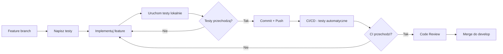
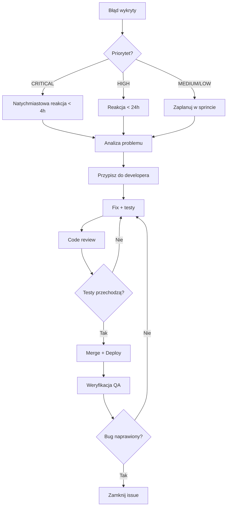

# Plan Testów - 10x Cards

## 1. Wprowadzenie i Cele Testowania

### 1.1 Cel dokumentu

Niniejszy dokument przedstawia kompleksowy plan testów dla aplikacji **10x Cards** - systemu do tworzenia i zarządzania fiszkami z wykorzystaniem sztucznej inteligencji. Plan ten określa strategię testowania, zakres, metody oraz narzędzia, które będą wykorzystane w celu zapewnienia wysokiej jakości aplikacji.

### 1.2 Cel testowania

Głównym celem testowania jest weryfikacja poprawności działania aplikacji oraz zapewnienie, że:

- **Generowanie fiszek AI** działa zgodnie z oczekiwaniami i zwraca poprawne, użyteczne wyniki
- **System autentykacji** (logowanie, rejestracja) jest bezpieczny i niezawodny
- **Zarządzanie fiszkami** (CRUD) funkcjonuje poprawnie we wszystkich scenariuszach
- **Rate limiting** skutecznie chroni przed nadmiernym wykorzystaniem API
- **Integracja z Supabase** i OpenRouter.ai jest stabilna i odporna na błędy
- **Walidacja danych** działa prawidłowo na wszystkich poziomach aplikacji
- **Interfejs użytkownika** jest responsywny, dostępny i intuicyjny

### 1.3 Zakres odpowiedzialności

Testy będą obejmować zarówno warstwy:

- **Backend** - API endpoints, services, walidacja, baza danych
- **Frontend** - komponenty React/Astro, integracja z API, UX
- **Integracje** - Supabase Auth, Database, OpenRouter.ai

### 1.4 Kluczowe wskaźniki sukcesu

- ✅ Pokrycie kodu testami jednostkowymi: minimum 80%
- ✅ Wszystkie krytyczne ścieżki użytkownika pokryte testami E2E
- ✅ Zero błędów krytycznych w produkcji
- ✅ Czas odpowiedzi API < 2s dla 95% requestów
- ✅ Wszystkie testy przechodzą w CI/CD przed deploymentem

---

## 2. Zakres Testów

### 2.1 Funkcjonalności objęte testami

#### 2.1.1 Priorytet KRYTYCZNY ⚠️

**Autentykacja i autoryzacja:**

- Rejestracja nowego użytkownika
- Logowanie użytkownika (email + hasło)
- Wylogowanie
- Weryfikacja sesji i automatyczne odświeżanie tokenów
- Middleware autentykacji
- Ochrona chronionych endpointów API

**Generowanie fiszek AI:**

- Generowanie propozycji fiszek z tekstu źródłowego
- Walidacja długości tekstu źródłowego (1000-10000 znaków)
- Obsługa błędów API OpenRouter
- Rate limiting (10 generacji/dzień/użytkownik)
- Zapisywanie metadanych generacji do bazy danych
- Logowanie błędów generacji

#### 2.1.2 Priorytet WYSOKI 🔴

**Zarządzanie fiszkami:**

- Tworzenie pojedynczej fiszki (manual)
- Tworzenie wielu fiszek naraz (bulk) po generacji AI
- Edycja fiszki z automatycznym przejściem źródła (ai-full → ai-edited)
- Usuwanie fiszki
- Pobieranie listy fiszek z paginacją i filtrowaniem
- Pobieranie pojedynczej fiszki

**Walidacja danych:**

- Walidacja pól fiszki (front: max 200 znaków, back: max 500 znaków)
- Walidacja parametrów query (paginacja, sortowanie, filtry)
- Walidacja danych wejściowych generacji
- Walidacja odpowiedzi AI

#### 2.1.3 Priorytet ŚREDNI 🟡

**Zarządzanie kontem:**

- Pobieranie informacji o koncie
- Usuwanie konta użytkownika (cascade delete)

**Historia generacji:**

- Zapisywanie metadanych generacji
- Liczniki akceptowanych fiszek (edited/unedited)
- Logowanie błędów API

### 2.2 Funkcjonalności wyłączone z testów

- Integracja z systemami zewnętrznymi (poza OpenRouter i Supabase)
- Testy wydajnościowe (load testing) - na późniejszym etapie
- Testy security penetracyjne - na późniejszym etapie
- Testy na przeglądarkach mobilnych - w fazie MVP

### 2.3 Kryteria wejścia i wyjścia

**Kryteria wejścia (rozpoczęcia testów):**

- ✅ Kod źródłowy dostępny w repozytorium
- ✅ Środowisko lokalne skonfigurowane (Supabase local)
- ✅ Narzędzia testowe zainstalowane (Vitest, Playwright)
- ✅ Dokumentacja API dostępna

**Kryteria wyjścia (zakończenia testów):**

- ✅ Wszystkie zaplanowane testy wykonane
- ✅ Pokrycie kodu minimum 80%
- ✅ Zero błędów krytycznych
- ✅ Wszystkie błędy wysokiego priorytetu naprawione
- ✅ Raport z testów zaakceptowany przez team

---

## 3. Typy Testów i Narzędzia

### 3.1 Strategia testowania

Strategia testowania została podzielona na dwie główne fazy:

**Faza 1: Testy jednostkowe (Unit Tests)** - Vitest

- Fokus na izolowanych jednostkach kodu (funkcje, klasy, komponenty)
- Wysokie pokrycie kodu (80%+)
- Szybkie wykonanie testów
- Integracja z CI/CD

**Faza 2: Testy End-to-End (E2E Tests)** - Playwright

- Fokus na krytycznych ścieżkach użytkownika
- Testowanie przepływów biznesowych
- Integracja wszystkich warstw aplikacji
- Testy w rzeczywistym środowisku przeglądarki

### 3.2 Testy jednostkowe - Vitest

#### 3.2.1 Zakres testów jednostkowych

**Backend (Priority: HIGH):**

- ✅ **Services** - FlashcardService, GenerationService, RateLimitService
  - Logika biznesowa
  - Interakcje z bazą danych (mockowane)
  - Obsługa błędów
- ✅ **Validation Schemas** - Zod schemas
  - Walidacja poprawnych danych
  - Wykrywanie niepoprawnych danych
  - Komunikaty błędów
- ✅ **Utilities** - Helper functions
  - Funkcje hashowania (MD5)
  - Transformacje danych
  - Formatowanie dat

- ✅ **API Endpoints** (Unit-level testing)
  - Walidacja requestów
  - Walidacja responses
  - Kody statusu HTTP
  - Obsługa błędów

**Frontend (Priority: MEDIUM):**

- ✅ **React Hooks** - Custom hooks
  - useAuth, useAccount, useFlashcardForm, useFlashcardList, useGenerator
  - Stan komponentu
  - Side effects
  - Error handling
- ✅ **React Components** - Komponenty UI
  - Renderowanie
  - Props validation
  - Interakcje użytkownika (mockowane eventy)
  - Conditional rendering

- ✅ **Utilities** - Frontend helpers
  - Funkcje formatujące
  - Walidacja client-side
  - API client functions

#### 3.2.2 Konfiguracja Vitest

**Instalacja:**

```bash
npm install -D vitest @vitest/ui @vitest/coverage-v8
npm install -D @testing-library/react @testing-library/jest-dom
npm install -D @testing-library/user-event
npm install -D msw # Mock Service Worker dla API mocking
```

**Plik konfiguracyjny: `vitest.config.ts`**

```typescript
import { defineConfig } from "vitest/config";
import react from "@vitejs/plugin-react";
import { resolve } from "path";

export default defineConfig({
  plugins: [react()],
  test: {
    globals: true,
    environment: "jsdom",
    setupFiles: ["./src/test/setup.ts"],
    coverage: {
      provider: "v8",
      reporter: ["text", "json", "html"],
      exclude: ["node_modules/", "src/test/", "**/*.d.ts", "**/*.config.*", "**/mockData", "dist/"],
      thresholds: {
        lines: 80,
        functions: 80,
        branches: 80,
        statements: 80,
      },
    },
  },
  resolve: {
    alias: {
      "@": resolve(__dirname, "./src"),
    },
  },
});
```

**Struktura katalogów testowych:**

```
src/
├── lib/
│   ├── services/
│   │   ├── flashcard.service.ts
│   │   ├── flashcard.service.test.ts
│   │   ├── generation.service.ts
│   │   └── generation.service.test.ts
│   ├── validation/
│   │   ├── flashcard.schemas.ts
│   │   └── flashcard.schemas.test.ts
│   └── utils/
│       ├── hash.ts
│       └── hash.test.ts
├── components/
│   └── flashcards/
│       ├── FlashcardCard.tsx
│       └── FlashcardCard.test.tsx
└── test/
    ├── setup.ts
    ├── mocks/
    │   ├── supabase.mock.ts
    │   └── handlers.ts
    └── fixtures/
        └── flashcards.fixture.ts
```

#### 3.2.3 Przykłady testów jednostkowych

**Test serwisu - FlashcardService:**

```typescript
// flashcard.service.test.ts
import { describe, it, expect, beforeEach, vi } from "vitest";
import { FlashcardService } from "./flashcard.service";
import { createMockSupabaseClient } from "@/test/mocks/supabase.mock";

describe("FlashcardService", () => {
  let service: FlashcardService;
  let mockSupabase: ReturnType<typeof createMockSupabaseClient>;

  beforeEach(() => {
    mockSupabase = createMockSupabaseClient();
    service = new FlashcardService(mockSupabase);
  });

  describe("getFlashcards", () => {
    it("should return paginated flashcards", async () => {
      // Arrange
      const userId = "user-123";
      const query = { page: 1, limit: 10, sort: "created_at", order: "desc" };

      // Act
      const result = await service.getFlashcards(userId, query);

      // Assert
      expect(result.flashcards).toBeDefined();
      expect(result.pagination.page).toBe(1);
      expect(mockSupabase.from).toHaveBeenCalledWith("flashcards");
    });

    it("should filter by source", async () => {
      // Test implementation
    });
  });
});
```

**Test walidacji - Zod Schema:**

```typescript
// flashcard.schemas.test.ts
import { describe, it, expect } from "vitest";
import { CreateFlashcardSchema } from "./flashcard.schemas";

describe("CreateFlashcardSchema", () => {
  it("should validate correct flashcard data", () => {
    const validData = {
      front: "Question",
      back: "Answer",
    };

    const result = CreateFlashcardSchema.safeParse(validData);
    expect(result.success).toBe(true);
  });

  it("should reject front text exceeding 200 characters", () => {
    const invalidData = {
      front: "x".repeat(201),
      back: "Answer",
    };

    const result = CreateFlashcardSchema.safeParse(invalidData);
    expect(result.success).toBe(false);
  });
});
```

### 3.3 Testy End-to-End - Playwright

#### 3.3.1 Zakres testów E2E

**Krytyczne ścieżki użytkownika (Priority: CRITICAL):**

1. **Pełny flow rejestracji i logowania**
   - Rejestracja nowego konta
   - Weryfikacja email (jeśli wymagana)
   - Logowanie
   - Nawigacja do dashboard

2. **Flow generowania fiszek AI**
   - Logowanie użytkownika
   - Przejście do generatora
   - Wprowadzenie tekstu źródłowego
   - Wygenerowanie propozycji
   - Akceptacja/edycja fiszek
   - Zapis do kolekcji
   - Weryfikacja w liście fiszek

3. **Flow zarządzania fiszkami**
   - Tworzenie ręcznej fiszki
   - Edycja fiszki
   - Filtrowanie i sortowanie listy
   - Usuwanie fiszki

4. **Rate limiting flow**
   - Osiągnięcie limitu generacji (10/dzień)
   - Wyświetlenie komunikatu o limicie
   - Próba kolejnej generacji

#### 3.3.2 Konfiguracja Playwright

**Instalacja:**

```bash
npm init playwright@latest
```

**Plik konfiguracyjny: `playwright.config.ts`**

```typescript
import { defineConfig, devices } from "@playwright/test";

export default defineConfig({
  testDir: "./e2e",
  fullyParallel: true,
  forbidOnly: !!process.env.CI,
  retries: process.env.CI ? 2 : 0,
  workers: process.env.CI ? 1 : undefined,
  reporter: "html",

  use: {
    baseURL: "http://localhost:4321",
    trace: "on-first-retry",
    screenshot: "only-on-failure",
  },

  projects: [
    {
      name: "chromium",
      use: { ...devices["Desktop Chrome"] },
    },
    // Firefox i Safari później
  ],

  webServer: {
    command: "npm run dev",
    url: "http://localhost:4321",
    reuseExistingServer: !process.env.CI,
  },
});
```

**Struktura katalogów E2E:**

```
e2e/
├── auth/
│   ├── register.spec.ts
│   └── login.spec.ts
├── flashcards/
│   ├── create.spec.ts
│   ├── edit.spec.ts
│   └── list.spec.ts
├── generator/
│   ├── generate.spec.ts
│   └── rate-limit.spec.ts
├── fixtures/
│   └── auth.fixture.ts
└── helpers/
    └── test-helpers.ts
```

#### 3.3.3 Przykłady testów E2E

**Test flow generowania:**

```typescript
// e2e/generator/generate.spec.ts
import { test, expect } from "@playwright/test";

test.describe("AI Flashcard Generation Flow", () => {
  test.beforeEach(async ({ page }) => {
    // Login first
    await page.goto("/auth/login");
    await page.fill('input[name="email"]', "test@example.com");
    await page.fill('input[name="password"]', "password123");
    await page.click('button[type="submit"]');
    await page.waitForURL("/app/flashcards");
  });

  test("should generate flashcards from text", async ({ page }) => {
    // Navigate to generator
    await page.goto("/app/generator");

    // Fill source text
    const sourceText = "x".repeat(1500); // Valid length text
    await page.fill('textarea[name="source_text"]', sourceText);

    // Submit generation
    await page.click('button[type="submit"]');

    // Wait for results
    await expect(page.locator('[data-testid="flashcard-proposal"]')).toHaveCount(5, { timeout: 10000 });

    // Accept first flashcard
    await page.click('[data-testid="accept-flashcard-0"]');

    // Save to collection
    await page.click('[data-testid="save-flashcards"]');

    // Verify success
    await expect(page.locator('[data-testid="success-toast"]')).toBeVisible();

    // Check in flashcard list
    await page.goto("/app/flashcards");
    await expect(page.locator('[data-testid="flashcard-card"]')).toHaveCount.greaterThanOrEqual(1);
  });
});
```

### 3.4 Narzędzia wspierające

**Dodatkowe narzędzia:**

- **MSW (Mock Service Worker)** - Mockowanie API w testach jednostkowych
- **Testing Library** - Testowanie komponentów React
- **Faker.js** - Generowanie danych testowych
- **Istanbul/c8** - Analiza pokrycia kodu

**Komendy NPM:**

```json
{
  "scripts": {
    "test": "vitest",
    "test:ui": "vitest --ui",
    "test:coverage": "vitest run --coverage",
    "test:e2e": "playwright test",
    "test:e2e:ui": "playwright test --ui",
    "test:e2e:debug": "playwright test --debug"
  }
}
```

---

## 4. Scenariusze Testowe dla Kluczowych Funkcjonalności

### 4.1 Autentykacja i Autoryzacja

#### 4.1.1 Rejestracja użytkownika

**ID:** AUTH-REG-001  
**Priorytet:** KRYTYCZNY ⚠️  
**Typ testu:** E2E + Unit

| **Przypadek testowy**        | **Kroki**                                                                                                                                              | **Oczekiwany rezultat**                                                                                                              | **Status** |
| ---------------------------- | ------------------------------------------------------------------------------------------------------------------------------------------------------ | ------------------------------------------------------------------------------------------------------------------------------------ | ---------- |
| **Poprawna rejestracja**     | 1. Przejdź do `/auth/register`<br>2. Wprowadź poprawny email<br>3. Wprowadź hasło (min 6 znaków)<br>4. Potwierdź hasło<br>5. Kliknij "Zarejestruj się" | • Konto utworzone w Supabase Auth<br>• Użytkownik zalogowany<br>• Redirect do `/app/flashcards`<br>• Wyświetlenie komunikatu sukcesu | 🔴 TODO    |
| **Duplikat email**           | 1. Zarejestruj użytkownika z emailem<br>2. Spróbuj zarejestrować ponownie z tym samym emailem                                                          | • Błąd: "Email already registered"<br>• Status 400<br>• Użytkownik pozostaje na formularzu                                           | 🔴 TODO    |
| **Niepoprawny format email** | 1. Wprowadź email bez `@`<br>2. Kliknij "Zarejestruj się"                                                                                              | • Błąd walidacji: "Invalid email format"<br>• Formularz nie wysłany                                                                  | 🔴 TODO    |
| **Hasło za krótkie**         | 1. Wprowadź hasło < 6 znaków<br>2. Kliknij "Zarejestruj się"                                                                                           | • Błąd: "Password must be at least 6 characters"<br>• Formularz nie wysłany                                                          | 🔴 TODO    |
| **Hasła się nie zgadzają**   | 1. Wprowadź różne hasła w polach<br>2. Kliknij "Zarejestruj się"                                                                                       | • Błąd: "Passwords do not match"<br>• Formularz nie wysłany                                                                          | 🔴 TODO    |

**Testy jednostkowe:**

```typescript
// src/pages/api/auth/register.test.ts
describe("POST /api/auth/register", () => {
  it("should create user with valid data", async () => {
    const response = await POST({
      request: createMockRequest({
        email: "new@example.com",
        password: "password123",
      }),
      locals: mockLocals,
    });

    expect(response.status).toBe(201);
    expect(await response.json()).toMatchObject({
      success: true,
      data: { user: { email: "new@example.com" } },
    });
  });

  it("should reject duplicate email", async () => {
    // Mock Supabase error for duplicate user
    const response = await POST(/* ... */);
    expect(response.status).toBe(400);
  });
});
```

#### 4.1.2 Logowanie użytkownika

**ID:** AUTH-LOGIN-001  
**Priorytet:** KRYTYCZNY ⚠️  
**Typ testu:** E2E + Unit

| **Przypadek testowy**        | **Kroki**                                                                               | **Oczekiwany rezultat**                                                                                                                    | **Status** |
| ---------------------------- | --------------------------------------------------------------------------------------- | ------------------------------------------------------------------------------------------------------------------------------------------ | ---------- |
| **Poprawne logowanie**       | 1. Przejdź do `/`<br>2. Wprowadź poprawny email i hasło<br>3. Kliknij "Zaloguj się"     | • Sesja utworzona (cookies: sb-access-token, sb-refresh-token)<br>• Redirect do `/app/flashcards`<br>• Sidebar wyświetla email użytkownika | 🔴 TODO    |
| **Niepoprawne hasło**        | 1. Wprowadź poprawny email<br>2. Wprowadź niepoprawne hasło<br>3. Kliknij "Zaloguj się" | • Błąd: "Invalid email or password"<br>• Status 401<br>• Użytkownik pozostaje na stronie logowania                                         | 🔴 TODO    |
| **Nieistniejący użytkownik** | 1. Wprowadź email nieistniejącego użytkownika<br>2. Kliknij "Zaloguj się"               | • Błąd: "Invalid email or password"<br>• Status 401                                                                                        | 🔴 TODO    |
| **Puste pole email**         | 1. Pozostaw email pusty<br>2. Kliknij "Zaloguj się"                                     | • Błąd walidacji: "Email is required"<br>• Formularz nie wysłany                                                                           | 🔴 TODO    |
| **Sesja wygasła (refresh)**  | 1. Zaloguj się<br>2. Mock wygaśnięcia access token<br>3. Odśwież stronę                 | • Middleware automatycznie odświeża token<br>• Użytkownik pozostaje zalogowany                                                             | 🔴 TODO    |

**Testy jednostkowe:**

```typescript
// src/pages/api/auth/login.test.ts
describe("POST /api/auth/login", () => {
  it("should login user with valid credentials", async () => {
    const response = await POST({
      request: createMockRequest({
        email: "test@example.com",
        password: "password123",
      }),
      locals: mockLocals,
      cookies: mockCookies,
    });

    expect(response.status).toBe(200);
    expect(mockCookies.set).toHaveBeenCalledWith("sb-access-token", expect.any(String), expect.any(Object));
  });
});
```

#### 4.1.3 Wylogowanie

**ID:** AUTH-LOGOUT-001  
**Priorytet:** WYSOKI 🔴  
**Typ testu:** E2E + Unit

| **Przypadek testowy**    | **Kroki**                                                                             | **Oczekiwany rezultat**                                                                                                                           | **Status** |
| ------------------------ | ------------------------------------------------------------------------------------- | ------------------------------------------------------------------------------------------------------------------------------------------------- | ---------- |
| **Poprawne wylogowanie** | 1. Zaloguj się<br>2. Kliknij przycisk "Wyloguj" w sidebar<br>3. Potwierdź wylogowanie | • Cookies usunięte (sb-access-token, sb-refresh-token)<br>• Sesja zakończona w Supabase<br>• Redirect do `/`<br>• Wyświetlenie komunikatu sukcesu | 🔴 TODO    |

#### 4.1.4 Ochrona chronionych route'ów

**ID:** AUTH-GUARD-001  
**Priorytet:** KRYTYCZNY ⚠️  
**Typ testu:** Integration + E2E

| **Przypadek testowy**                  | **Kroki**                                                     | **Oczekiwany rezultat**                                                        | **Status** |
| -------------------------------------- | ------------------------------------------------------------- | ------------------------------------------------------------------------------ | ---------- |
| **Dostęp bez autentykacji do /app/\*** | 1. Wyloguj się<br>2. Spróbuj przejść do `/app/flashcards`     | • Redirect do `/` (strona logowania)<br>• Flash message: "Please log in first" | 🔴 TODO    |
| **Dostęp do API bez tokenu**           | 1. Wywołaj `GET /api/flashcards` bez tokenu                   | • Status 401<br>• Response: `{ error: { code: "UNAUTHORIZED" } }`              | 🔴 TODO    |
| **Dostęp z wygasłym tokenem**          | 1. Wywołaj API z wygasłym access token i ważnym refresh token | • Middleware automatycznie odświeża token<br>• Request wykonany poprawnie      | 🔴 TODO    |

**Testy jednostkowe:**

```typescript
// src/lib/auth/guards.test.ts
describe("requireAuth", () => {
  it("should redirect to login if not authenticated", async () => {
    const context = createMockContext({ user: null });
    const response = await requireAuth(context);

    expect(response.status).toBe(302);
    expect(response.headers.get("Location")).toBe("/");
  });

  it("should allow access if authenticated", async () => {
    const context = createMockContext({
      user: { id: "user-123", email: "test@example.com" },
    });
    const response = await requireAuth(context);

    expect(response).toBeNull(); // No redirect
  });
});
```

### 4.2 Generowanie Fiszek AI

#### 4.2.1 Generowanie propozycji fiszek

**ID:** GEN-AI-001  
**Priorytet:** KRYTYCZNY ⚠️  
**Typ testu:** E2E + Unit + Integration

| **Przypadek testowy**                 | **Kroki**                                                                                                 | **Oczekiwany rezultat**                                                                                                                                                                 | **Status** |
| ------------------------------------- | --------------------------------------------------------------------------------------------------------- | --------------------------------------------------------------------------------------------------------------------------------------------------------------------------------------- | ---------- |
| **Poprawne generowanie**              | 1. Zaloguj się<br>2. Przejdź do `/app/generator`<br>3. Wprowadź tekst 1500 znaków<br>4. Kliknij "Generuj" | • Status 201<br>• Response zawiera 5-8 propozycji fiszek<br>• Każda fiszka ma `front`, `back`, `source: "ai-full"`<br>• Record w tabeli `generations`<br>• Wyświetlenie propozycji w UI | 🔴 TODO    |
| **Tekst za krótki (< 1000 znaków)**   | 1. Wprowadź tekst 500 znaków<br>2. Kliknij "Generuj"                                                      | • Status 400<br>• Błąd: "Text must be between 1000-10000 characters"<br>• `current_length: 500` w details                                                                               | 🔴 TODO    |
| **Tekst za długi (> 10000 znaków)**   | 1. Wprowadź tekst 15000 znaków<br>2. Kliknij "Generuj"                                                    | • Status 400<br>• Błąd walidacji długości                                                                                                                                               | 🔴 TODO    |
| **Błąd API OpenRouter**               | 1. Mock błędu API (timeout/error)<br>2. Wywołaj generowanie                                               | • Status 503<br>• Error code: "AI_SERVICE_ERROR"<br>• Błąd zalogowany w `generation_error_logs`<br>• User-friendly message w UI                                                         | 🔴 TODO    |
| **Niepoprawna odpowiedź AI (format)** | 1. Mock odpowiedzi AI w złym formacie<br>2. Wywołaj generowanie                                           | • Status 503<br>• Error code: "AI_SERVICE_ERROR" / "VALIDATION_ERROR"<br>• Błąd zalogowany                                                                                              | 🔴 TODO    |
| **Generowanie w trybie MOCK**         | 1. Ustaw `OPENROUTER_USE_MOCK=true`<br>2. Wywołaj generowanie                                             | • Status 201<br>• Response zawiera 5 mockowanych fiszek<br>• Model: "model-name (mock)"<br>• Czas: 2-3 sekundy                                                                          | 🔴 TODO    |

**Testy jednostkowe:**

```typescript
// src/lib/services/generation.service.test.ts
describe("GenerationService", () => {
  describe("generateFlashcards", () => {
    it("should generate flashcards in mock mode", async () => {
      const service = new GenerationService(mockSupabase);
      const sourceText = "x".repeat(1500);

      const result = await service.generateFlashcards(sourceText, "", "gpt-4");

      expect(result.flashcards_proposals).toHaveLength(5);
      expect(result.model).toContain("(mock)");
      expect(result.duration_ms).toBeGreaterThan(0);
    });

    it("should throw AIServiceError on OpenRouter API error", async () => {
      // Mock API error
      await expect(service.generateFlashcards(/* ... */)).rejects.toThrow(AIServiceError);
    });
  });

  describe("parseAIResponse", () => {
    it("should parse valid AI response", () => {
      const response = {
        flashcards: [
          { front: "Q1", back: "A1" },
          { front: "Q2", back: "A2" },
        ],
      };

      const result = service["parseAIResponse"](response);
      expect(result).toHaveLength(2);
      expect(result[0].source).toBe("ai-full");
    });

    it("should throw error on invalid response format", () => {
      expect(() => service["parseAIResponse"]({ invalid: true })).toThrow(AIServiceError);
    });
  });
});
```

#### 4.2.2 Rate Limiting

**ID:** GEN-RATE-001  
**Priorytet:** KRYTYCZNY ⚠️  
**Typ testu:** Integration + E2E

| **Przypadek testowy**                    | **Kroki**                                                                                              | **Oczekiwany rezultat**                                                                                                                                                                 | **Status** |
| ---------------------------------------- | ------------------------------------------------------------------------------------------------------ | --------------------------------------------------------------------------------------------------------------------------------------------------------------------------------------- | ---------- |
| **Osiągnięcie limitu (10/dzień)**        | 1. Zaloguj się<br>2. Wykonaj 10 generacji<br>3. Spróbuj wykonać 11. generację                          | • Status 429 (Too Many Requests)<br>• Error code: "RATE_LIMIT_EXCEEDED"<br>• Response zawiera `retry_after` (timestamp następnego dnia 00:00 UTC)<br>• UI wyświetla komunikat o limicie | 🔴 TODO    |
| **Reset limitu po północy UTC**          | 1. Wykonaj 10 generacji<br>2. Mock czasu na następny dzień (00:00 UTC)<br>3. Spróbuj wykonać generację | • Status 201<br>• Generowanie wykonane poprawnie<br>• Licznik resetu do 1/10                                                                                                            | 🔴 TODO    |
| **Różni użytkownicy, niezależne limity** | 1. User A wykonuje 10 generacji<br>2. User B próbuje wykonać generację                                 | • User B może wykonać generację<br>• Limit dla User A nie wpływa na User B                                                                                                              | 🔴 TODO    |
| **Pomiń rate limit w trybie MOCK**       | 1. Ustaw `OPENROUTER_USE_MOCK=true`<br>2. Wykonaj 15 generacji                                         | • Wszystkie generacje przechodzą<br>• Brak błędu rate limit                                                                                                                             | 🔴 TODO    |

**Testy jednostkowe:**

```typescript
// src/lib/services/rateLimit.service.test.ts
describe("RateLimitService", () => {
  describe("checkRateLimit", () => {
    it("should allow generation when under limit", async () => {
      // Mock 5 generations today
      mockSupabase.from().select().count.mockResolvedValue({ count: 5 });

      const result = await service.checkRateLimit("user-123");

      expect(result.exceeded).toBe(false);
      expect(result.currentCount).toBe(5);
      expect(result.limit).toBe(10);
    });

    it("should block generation when limit exceeded", async () => {
      // Mock 10 generations today
      mockSupabase.from().select().count.mockResolvedValue({ count: 10 });

      const result = await service.checkRateLimit("user-123");

      expect(result.exceeded).toBe(true);
      expect(result.retryAfter).toBeDefined();
    });

    it("should calculate retry_after as next day 00:00 UTC", async () => {
      mockSupabase.from().select().count.mockResolvedValue({ count: 10 });

      const result = await service.checkRateLimit("user-123");
      const retryDate = new Date(result.retryAfter!);

      expect(retryDate.getUTCHours()).toBe(0);
      expect(retryDate.getUTCMinutes()).toBe(0);
    });
  });
});
```

#### 4.2.3 Zapisywanie metadanych generacji

**ID:** GEN-META-001  
**Priorytet:** WYSOKI 🔴  
**Typ testu:** Integration + Unit

| **Przypadek testowy**             | **Kroki**                                                                         | **Oczekiwany rezultat**                                                                                                                                                                                                                                                   | **Status** |
| --------------------------------- | --------------------------------------------------------------------------------- | ------------------------------------------------------------------------------------------------------------------------------------------------------------------------------------------------------------------------------------------------------------------------- | ---------- |
| **Zapis metadanych po generacji** | 1. Wykonaj generowanie<br>2. Sprawdź tabelę `generations`                         | • Record utworzony z:<br>&nbsp;&nbsp;- `user_id`<br>&nbsp;&nbsp;- `duration_ms`<br>&nbsp;&nbsp;- `model`<br>&nbsp;&nbsp;- `generated_count` (5-8)<br>&nbsp;&nbsp;- `source_text_hash` (MD5)<br>&nbsp;&nbsp;- `source_text_length`<br>&nbsp;&nbsp;- `accepted_*_count` (0) | 🔴 TODO    |
| **Logowanie błędów generacji**    | 1. Mock błędu API<br>2. Wywołaj generowanie<br>3. Sprawdź `generation_error_logs` | • Record błędu utworzony z:<br>&nbsp;&nbsp;- `user_id`<br>&nbsp;&nbsp;- `error_code`<br>&nbsp;&nbsp;- `error_message`<br>&nbsp;&nbsp;- `model`<br>&nbsp;&nbsp;- `source_text_hash`                                                                                        | 🔴 TODO    |

### 4.3 Zarządzanie Fiszkami (CRUD)

#### 4.3.1 Tworzenie fiszki (POST /api/flashcards)

**ID:** FLASH-CREATE-001  
**Priorytet:** WYSOKI 🔴  
**Typ testu:** E2E + Unit + Integration

| **Przypadek testowy**                  | **Kroki**                                                                                      | **Oczekiwany rezultat**                                                                                                         | **Status** |
| -------------------------------------- | ---------------------------------------------------------------------------------------------- | ------------------------------------------------------------------------------------------------------------------------------- | ---------- |
| **Poprawne utworzenie ręcznej fiszki** | 1. Zaloguj się<br>2. Przejdź do `/app/flashcards/new`<br>3. Wprowadź front i back<br>4. Zapisz | • Status 201<br>• Fiszka utworzona z `source: "manual"`<br>• `generation_id: null`<br>• Redirect do listy<br>• Toast z sukcesem | 🔴 TODO    |
| **Front > 200 znaków**                 | 1. Wprowadź front z 201 znakami<br>2. Zapisz                                                   | • Status 400<br>• Błąd: "Front text must not exceed 200 characters"<br>• Formularz nie wysłany                                  | 🔴 TODO    |
| **Back > 500 znaków**                  | 1. Wprowadź back z 501 znakami<br>2. Zapisz                                                    | • Status 400<br>• Błąd: "Back text must not exceed 500 characters"                                                              | 🔴 TODO    |
| **Puste pole front**                   | 1. Pozostaw front pusty<br>2. Zapisz                                                           | • Status 400<br>• Błąd: "Front text is required"                                                                                | 🔴 TODO    |
| **Puste pole back**                    | 1. Pozostaw back pusty<br>2. Zapisz                                                            | • Status 400<br>• Błąd: "Back text is required"                                                                                 | 🔴 TODO    |
| **Whitespace trimming**                | 1. Wprowadź `"  Front  "` i `"  Back  "`<br>2. Zapisz                                          | • Wartości zapisane jako `"Front"` i `"Back"` (bez białych znaków na początku/końcu)                                            | 🔴 TODO    |

**Testy jednostkowe:**

```typescript
// src/lib/services/flashcard.service.test.ts
describe("FlashcardService.createFlashcard", () => {
  it("should create manual flashcard with valid data", async () => {
    const command = { front: "Question", back: "Answer" };
    const userId = "user-123";

    const result = await service.createFlashcard(userId, command);

    expect(result.front).toBe("Question");
    expect(result.back).toBe("Answer");
    expect(result.source).toBe("manual");
    expect(result.generation_id).toBeNull();
    expect(mockSupabase.from).toHaveBeenCalledWith("flashcards");
  });

  it("should trim whitespace from front and back", async () => {
    const command = { front: "  Question  ", back: "  Answer  " };

    const result = await service.createFlashcard("user-123", command);

    expect(result.front).toBe("Question");
    expect(result.back).toBe("Answer");
  });
});
```

#### 4.3.2 Tworzenie wielu fiszek (POST /api/flashcards/bulk)

**ID:** FLASH-BULK-001  
**Priorytet:** KRYTYCZNY ⚠️  
**Typ testu:** Integration + Unit

| **Przypadek testowy**                       | **Kroki**                                                                           | **Oczekiwany rezultat**                                                                                                         | **Status** |
| ------------------------------------------- | ----------------------------------------------------------------------------------- | ------------------------------------------------------------------------------------------------------------------------------- | ---------- |
| **Poprawne utworzenie bulk fiszek**         | 1. Wygeneruj fiszki AI<br>2. Zaakceptuj 3 fiszki<br>3. Wywołaj bulk create          | • Status 201<br>• Response: `created_count: 3`<br>• Wszystkie fiszki mają `generation_id`<br>• Update liczników w `generations` | 🔴 TODO    |
| **Przekroczenie generated_count**           | 1. Generacja zwróciła 5 fiszek<br>2. Spróbuj zapisać 7 fiszek bulk                  | • Status 400<br>• Error code: "VALIDATION_ERROR"<br>• Message o przekroczeniu limitu<br>• Details: `available_slots: 5`         | 🔴 TODO    |
| **Akceptacja częściowa, potem kolejna**     | 1. Generacja: 5 fiszek<br>2. Bulk create: 3 fiszki<br>3. Bulk create: 2 fiszki      | • Obie operacje sukces<br>• Liczniki: `accepted_unedited_count` + `accepted_edited_count` = 5                                   | 🔴 TODO    |
| **Mieszane źródła (ai-full + ai-edited)**   | 1. Bulk z 2 ai-full i 3 ai-edited<br>2. Zapisz                                      | • Status 201<br>• Update: `accepted_unedited_count: 2`, `accepted_edited_count: 3`                                              | 🔴 TODO    |
| **Nieistniejący generation_id**             | 1. Wywołaj bulk z nieistniejącym `generation_id`<br>2. Zapisz                       | • Status 404<br>• Error: "Generation not found"                                                                                 | 🔴 TODO    |
| **Generation należy do innego użytkownika** | 1. User A generuje fiszki<br>2. User B próbuje bulk create z `generation_id` User A | • Status 404<br>• Error: "Generation not found" (z powodów bezpieczeństwa nie ujawniamy istnienia)                              | 🔴 TODO    |
| **Source musi być ai-full lub ai-edited**   | 1. Spróbuj bulk create z `source: "manual"`<br>2. Zapisz                            | • Status 400<br>• Error: "Source must be 'ai-full' or 'ai-edited'"                                                              | 🔴 TODO    |

**Testy jednostkowe:**

```typescript
// src/lib/services/flashcard.service.test.ts
describe("FlashcardService.createFlashcardsBulk", () => {
  it("should create multiple flashcards and update generation counters", async () => {
    const generationId = 1;
    const flashcards = [
      { front: "Q1", back: "A1", source: "ai-full" as const },
      { front: "Q2", back: "A2", source: "ai-edited" as const },
    ];

    // Mock generation with generated_count: 5
    mockSupabase
      .from()
      .select()
      .single.mockResolvedValue({
        data: { id: 1, generated_count: 5, accepted_unedited_count: 0, accepted_edited_count: 0 },
        error: null,
      });

    const result = await service.createFlashcardsBulk("user-123", generationId, flashcards);

    expect(result.created_count).toBe(2);
    expect(result.flashcards).toHaveLength(2);

    // Verify generation update was called
    expect(mockSupabase.from().update).toHaveBeenCalledWith({
      accepted_unedited_count: 1,
      accepted_edited_count: 1,
    });
  });

  it("should reject when trying to exceed generated_count", async () => {
    const generationId = 1;
    const flashcards = Array(6).fill({ front: "Q", back: "A", source: "ai-full" });

    // Mock generation with generated_count: 5
    mockSupabase
      .from()
      .select()
      .single.mockResolvedValue({
        data: { id: 1, generated_count: 5, accepted_unedited_count: 0, accepted_edited_count: 0 },
        error: null,
      });

    await expect(service.createFlashcardsBulk("user-123", generationId, flashcards)).rejects.toThrow(ValidationError);
  });
});
```

#### 4.3.3 Edycja fiszki (PATCH /api/flashcards/:id)

**ID:** FLASH-UPDATE-001  
**Priorytet:** WYSOKI 🔴  
**Typ testu:** E2E + Unit + Integration

| **Przypadek testowy**                     | **Kroki**                                                                      | **Oczekiwany rezultat**                                                                                     | **Status** |
| ----------------------------------------- | ------------------------------------------------------------------------------ | ----------------------------------------------------------------------------------------------------------- | ---------- |
| **Edycja ręcznej fiszki**                 | 1. Utwórz fiszki manual<br>2. Edytuj front<br>3. Zapisz                        | • Status 200<br>• Fiszka zaktualizowana<br>• `source` pozostaje `"manual"`<br>• `updated_at` zaktualizowany | 🔴 TODO    |
| **Edycja fiszki ai-full → ai-edited**     | 1. Utwórz fiszkę z generacji (ai-full)<br>2. Edytuj treść<br>3. Zapisz         | • Status 200<br>• `source` zmienione na `"ai-edited"`<br>• Treść zaktualizowana                             | 🔴 TODO    |
| **Edycja fiszki ai-edited**               | 1. Masz fiszkę ai-edited<br>2. Edytuj ponownie<br>3. Zapisz                    | • Status 200<br>• `source` pozostaje `"ai-edited"`                                                          | 🔴 TODO    |
| **Edycja tylko front**                    | 1. Edytuj tylko pole front<br>2. Zapisz                                        | • Status 200<br>• Front zaktualizowany<br>• Back pozostaje bez zmian                                        | 🔴 TODO    |
| **Edycja tylko back**                     | 1. Edytuj tylko pole back<br>2. Zapisz                                         | • Status 200<br>• Back zaktualizowany<br>• Front pozostaje bez zmian                                        | 🔴 TODO    |
| **Brak zmian (ta sama wartość)**          | 1. Edytuj fiszkę ai-full<br>2. Wprowadź dokładnie tę samą wartość<br>3. Zapisz | • Status 200<br>• `source` pozostaje `"ai-full"` (bo treść faktycznie się nie zmieniła)                     | 🔴 TODO    |
| **Edycja nieistniejącej fiszki**          | 1. Wywołaj PATCH dla nieistniejącego ID                                        | • Status 404<br>• Error: "Flashcard not found"                                                              | 🔴 TODO    |
| **Edycja fiszki innego użytkownika**      | 1. User A tworzy fiszkę<br>2. User B próbuje ją edytować                       | • Status 404<br>• Error: "Flashcard not found"                                                              | 🔴 TODO    |
| **Próba edycji bez żadnych zmian w body** | 1. Wywołaj PATCH z pustym body `{}`                                            | • Status 400<br>• Error: "At least one field (front or back) must be provided"                              | 🔴 TODO    |

**Testy jednostkowe:**

```typescript
// src/lib/services/flashcard.service.test.ts
describe("FlashcardService.updateFlashcard", () => {
  it("should update flashcard and transition ai-full to ai-edited when content changes", async () => {
    const existingFlashcard = {
      id: 1,
      user_id: "user-123",
      front: "Original Question",
      back: "Original Answer",
      source: "ai-full",
    };

    mockSupabase.from().select().single.mockResolvedValue({ data: existingFlashcard, error: null });

    const command = { front: "Updated Question" };

    const result = await service.updateFlashcard(1, "user-123", command);

    expect(mockSupabase.from().update).toHaveBeenCalledWith(
      expect.objectContaining({
        front: "Updated Question",
        source: "ai-edited", // Transition!
      })
    );
  });

  it("should keep source as manual when editing manual flashcard", async () => {
    const existingFlashcard = {
      id: 1,
      user_id: "user-123",
      front: "Question",
      back: "Answer",
      source: "manual",
    };

    mockSupabase.from().select().single.mockResolvedValue({ data: existingFlashcard, error: null });

    const command = { front: "Updated Question" };

    const result = await service.updateFlashcard(1, "user-123", command);

    expect(mockSupabase.from().update).toHaveBeenCalledWith(
      expect.objectContaining({
        front: "Updated Question",
        // source nie jest ustawione, pozostanie "manual"
      })
    );
  });

  it("should not transition source when content is identical", async () => {
    const existingFlashcard = {
      id: 1,
      user_id: "user-123",
      front: "Question",
      back: "Answer",
      source: "ai-full",
    };

    mockSupabase.from().select().single.mockResolvedValue({ data: existingFlashcard, error: null });

    const command = { front: "Question" }; // Ta sama wartość

    const result = await service.updateFlashcard(1, "user-123", command);

    expect(mockSupabase.from().update).toHaveBeenCalledWith(
      expect.not.objectContaining({
        source: expect.anything(),
      })
    );
  });
});
```

#### 4.3.4 Usuwanie fiszki (DELETE /api/flashcards/:id)

**ID:** FLASH-DELETE-001  
**Priorytet:** WYSOKI 🔴  
**Typ testu:** E2E + Unit

| **Przypadek testowy**                   | **Kroki**                                                    | **Oczekiwany rezultat**                                            | **Status** |
| --------------------------------------- | ------------------------------------------------------------ | ------------------------------------------------------------------ | ---------- |
| **Poprawne usunięcie fiszki**           | 1. Utwórz fiszkę<br>2. Usuń fiszkę<br>3. Potwierdź usunięcie | • Status 200<br>• Fiszka usunięta z bazy<br>• Success message w UI | 🔴 TODO    |
| **Usunięcie nieistniejącej fiszki**     | 1. Wywołaj DELETE dla nieistniejącego ID                     | • Status 404<br>• Error: "Flashcard not found"                     | 🔴 TODO    |
| **Usunięcie fiszki innego użytkownika** | 1. User A tworzy fiszkę<br>2. User B próbuje ją usunąć       | • Status 404<br>• Error: "Flashcard not found"                     | 🔴 TODO    |

**Testy jednostkowe:**

```typescript
// src/lib/services/flashcard.service.test.ts
describe("FlashcardService.deleteFlashcard", () => {
  it("should delete flashcard when it exists and belongs to user", async () => {
    mockSupabase
      .from()
      .select()
      .single.mockResolvedValue({ data: { id: 1 }, error: null });

    await service.deleteFlashcard(1, "user-123");

    expect(mockSupabase.from().delete).toHaveBeenCalledWith();
    expect(mockSupabase.from().eq).toHaveBeenCalledWith("id", 1);
    expect(mockSupabase.from().eq).toHaveBeenCalledWith("user_id", "user-123");
  });

  it("should throw NotFoundError when flashcard does not exist", async () => {
    mockSupabase
      .from()
      .select()
      .single.mockResolvedValue({ data: null, error: { message: "Not found" } });

    await expect(service.deleteFlashcard(999, "user-123")).rejects.toThrow(NotFoundError);
  });
});
```

#### 4.3.5 Pobieranie listy fiszek (GET /api/flashcards)

**ID:** FLASH-LIST-001  
**Priorytet:** WYSOKI 🔴  
**Typ testu:** E2E + Unit + Integration

| **Przypadek testowy**                   | **Kroki**                                                                 | **Oczekiwany rezultat**                                                                                             | **Status** |
| --------------------------------------- | ------------------------------------------------------------------------- | ------------------------------------------------------------------------------------------------------------------- | ---------- |
| **Pobieranie z domyślnymi parametrami** | 1. Wywołaj `GET /api/flashcards`                                          | • Status 200<br>• Paginacja: `page: 1`, `limit: 50`<br>• Sortowanie: `created_at desc`<br>• Lista fiszek + metadata | 🔴 TODO    |
| **Paginacja - strona 2**                | 1. Wywołaj `GET /api/flashcards?page=2&limit=10`                          | • Status 200<br>• Zwrócone fiszki 11-20<br>• Pagination metadata poprawna                                           | 🔴 TODO    |
| **Filtrowanie po source=manual**        | 1. Wywołaj `GET /api/flashcards?source=manual`                            | • Status 200<br>• Zwrócone tylko fiszki z `source: "manual"`                                                        | 🔴 TODO    |
| **Filtrowanie po source=ai-full**       | 1. Wywołaj `GET /api/flashcards?source=ai-full`                           | • Status 200<br>• Zwrócone tylko fiszki z `source: "ai-full"`                                                       | 🔴 TODO    |
| **Sortowanie po updated_at asc**        | 1. Wywołaj `GET /api/flashcards?sort=updated_at&order=asc`                | • Status 200<br>• Fiszki posortowane od najstarszej aktualizacji                                                    | 🔴 TODO    |
| **Niepoprawny parametr page (< 1)**     | 1. Wywołaj `GET /api/flashcards?page=0`                                   | • Status 400<br>• Error: "Page must be positive"                                                                    | 🔴 TODO    |
| **Limit > 100**                         | 1. Wywołaj `GET /api/flashcards?limit=150`                                | • Status 400<br>• Error: "Limit must be between 1 and 100"                                                          | 🔴 TODO    |
| **Niepoprawny source**                  | 1. Wywołaj `GET /api/flashcards?source=invalid`                           | • Status 400<br>• Error walidacji                                                                                   | 🔴 TODO    |
| **Użytkownik widzi tylko swoje fiszki** | 1. User A ma 10 fiszek<br>2. User B ma 5 fiszek<br>3. User A wywołuje GET | • Status 200<br>• User A widzi tylko swoje 10 fiszek<br>• User B widzi tylko swoje 5 fiszek                         | 🔴 TODO    |

**Testy jednostkowe:**

```typescript
// src/lib/services/flashcard.service.test.ts
describe("FlashcardService.getFlashcards", () => {
  it("should return paginated flashcards with default params", async () => {
    const query = { page: 1, limit: 50, sort: "created_at", order: "desc" };

    mockSupabase
      .from()
      .select()
      .count.mockResolvedValue({
        data: [{ id: 1 }, { id: 2 }],
        count: 2,
        error: null,
      });

    const result = await service.getFlashcards("user-123", query);

    expect(result.flashcards).toHaveLength(2);
    expect(result.pagination).toEqual({
      page: 1,
      limit: 50,
      total: 2,
      total_pages: 1,
    });
  });

  it("should apply source filter when provided", async () => {
    const query = { page: 1, limit: 50, sort: "created_at", order: "desc", source: "manual" as const };

    await service.getFlashcards("user-123", query);

    expect(mockSupabase.from().eq).toHaveBeenCalledWith("source", "manual");
  });

  it("should calculate pagination metadata correctly", async () => {
    const query = { page: 2, limit: 10, sort: "created_at", order: "desc" };

    mockSupabase
      .from()
      .select()
      .count.mockResolvedValue({
        data: Array(10).fill({}),
        count: 25,
        error: null,
      });

    const result = await service.getFlashcards("user-123", query);

    expect(result.pagination).toEqual({
      page: 2,
      limit: 10,
      total: 25,
      total_pages: 3,
    });

    // Verify offset calculation
    expect(mockSupabase.from().range).toHaveBeenCalledWith(10, 19);
  });
});
```

### 4.4 Walidacja Danych (Zod Schemas)

#### 4.4.1 Walidacja CreateFlashcardSchema

**ID:** VALID-CREATE-001  
**Priorytet:** WYSOKI 🔴  
**Typ testu:** Unit

| **Przypadek testowy**            | **Dane wejściowe**                      | **Oczekiwany rezultat**          | **Status** |
| -------------------------------- | --------------------------------------- | -------------------------------- | ---------- |
| **Poprawne dane**                | `{ front: "Q", back: "A" }`             | • Walidacja przechodzi           | 🔴 TODO    |
| **Front = 200 znaków (granica)** | `{ front: "x".repeat(200), back: "A" }` | • Walidacja przechodzi           | 🔴 TODO    |
| **Front = 201 znaków**           | `{ front: "x".repeat(201), back: "A" }` | • Błąd: max 200 characters       | 🔴 TODO    |
| **Back = 500 znaków (granica)**  | `{ front: "Q", back: "x".repeat(500) }` | • Walidacja przechodzi           | 🔴 TODO    |
| **Back = 501 znaków**            | `{ front: "Q", back: "x".repeat(501) }` | • Błąd: max 500 characters       | 🔴 TODO    |
| **Brak front**                   | `{ back: "A" }`                         | • Błąd: "Front text is required" | 🔴 TODO    |
| **Brak back**                    | `{ front: "Q" }`                        | • Błąd: "Back text is required"  | 🔴 TODO    |
| **Front z whitespace**           | `{ front: "  Q  ", back: "A" }`         | • Wartość po trim: "Q"           | 🔴 TODO    |
| **Front tylko whitespace**       | `{ front: "   ", back: "A" }`           | • Błąd: "Front text is required" | 🔴 TODO    |

#### 4.4.2 Walidacja GenerateFlashcardsSchema

**ID:** VALID-GEN-001  
**Priorytet:** KRYTYCZNY ⚠️  
**Typ testu:** Unit

| **Przypadek testowy**                | **Dane wejściowe**                   | **Oczekiwany rezultat**                | **Status** |
| ------------------------------------ | ------------------------------------ | -------------------------------------- | ---------- |
| **Tekst 1000 znaków (min granica)**  | `{ source_text: "x".repeat(1000) }`  | • Walidacja przechodzi                 | 🔴 TODO    |
| **Tekst 10000 znaków (max granica)** | `{ source_text: "x".repeat(10000) }` | • Walidacja przechodzi                 | 🔴 TODO    |
| **Tekst 999 znaków**                 | `{ source_text: "x".repeat(999) }`   | • Błąd: min 1000 characters            | 🔴 TODO    |
| **Tekst 10001 znaków**               | `{ source_text: "x".repeat(10001) }` | • Błąd: max 10000 characters           | 🔴 TODO    |
| **Brak source_text**                 | `{}`                                 | • Błąd: "Source text is required"      | 🔴 TODO    |
| **source_text nie jest stringiem**   | `{ source_text: 12345 }`             | • Błąd: "Source text must be a string" | 🔴 TODO    |

#### 4.4.3 Walidacja GetFlashcardsQuerySchema

**ID:** VALID-QUERY-001  
**Priorytet:** ŚREDNI 🟡  
**Typ testu:** Unit

| **Przypadek testowy**      | **Dane wejściowe**                         | **Oczekiwany rezultat**                                       | **Status** |
| -------------------------- | ------------------------------------------ | ------------------------------------------------------------- | ---------- |
| **Puste query (defaults)** | `{}`                                       | • `{ page: 1, limit: 50, sort: "created_at", order: "desc" }` | 🔴 TODO    |
| **Poprawne parametry**     | `{ page: 2, limit: 10, source: "manual" }` | • Walidacja przechodzi                                        | 🔴 TODO    |
| **Page = 0**               | `{ page: 0 }`                              | • Błąd: must be positive                                      | 🔴 TODO    |
| **Limit = 101**            | `{ limit: 101 }`                           | • Błąd: max 100                                               | 🔴 TODO    |
| **Niepoprawny source**     | `{ source: "invalid" }`                    | • Błąd: must be one of manual, ai-full, ai-edited             | 🔴 TODO    |
| **Niepoprawny sort**       | `{ sort: "invalid" }`                      | • Błąd: must be created_at or updated_at                      | 🔴 TODO    |
| **Niepoprawny order**      | `{ order: "invalid" }`                     | • Błąd: must be asc or desc                                   | 🔴 TODO    |

**Testy jednostkowe dla walidacji:**

```typescript
// src/lib/validation/flashcard.schemas.test.ts
describe("Flashcard Validation Schemas", () => {
  describe("CreateFlashcardSchema", () => {
    it("should validate correct flashcard data", () => {
      const result = CreateFlashcardSchema.safeParse({
        front: "Question",
        back: "Answer",
      });

      expect(result.success).toBe(true);
    });

    it("should reject front text exceeding 200 characters", () => {
      const result = CreateFlashcardSchema.safeParse({
        front: "x".repeat(201),
        back: "Answer",
      });

      expect(result.success).toBe(false);
      if (!result.success) {
        expect(result.error.errors[0].message).toContain("200");
      }
    });

    it("should trim whitespace from fields", () => {
      const result = CreateFlashcardSchema.safeParse({
        front: "  Question  ",
        back: "  Answer  ",
      });

      expect(result.success).toBe(true);
      if (result.success) {
        expect(result.data.front).toBe("Question");
        expect(result.data.back).toBe("Answer");
      }
    });
  });

  describe("GenerateFlashcardsSchema", () => {
    it("should accept text with exactly 1000 characters", () => {
      const result = GenerateFlashcardsSchema.safeParse({
        source_text: "x".repeat(1000),
      });

      expect(result.success).toBe(true);
    });

    it("should reject text with less than 1000 characters", () => {
      const result = GenerateFlashcardsSchema.safeParse({
        source_text: "x".repeat(999),
      });

      expect(result.success).toBe(false);
    });
  });

  describe("GetFlashcardsQuerySchema", () => {
    it("should apply default values when no params provided", () => {
      const result = GetFlashcardsQuerySchema.parse({});

      expect(result).toEqual({
        page: 1,
        limit: 50,
        sort: "created_at",
        order: "desc",
      });
    });

    it("should validate correct query params", () => {
      const result = GetFlashcardsQuerySchema.safeParse({
        page: 2,
        limit: 10,
        source: "manual",
        sort: "updated_at",
        order: "asc",
      });

      expect(result.success).toBe(true);
    });
  });
});
```

---

## 5. Środowisko Testowe i Konfiguracja

### 5.1 Środowisko lokalne (Development)

#### 5.1.1 Wymagania systemowe

**Oprogramowanie:**

- Node.js: v22.14.0 (zgodnie z `.nvmrc`)
- npm: 10+ (dołączone z Node.js)
- Docker Desktop (dla Supabase local)
- Supabase CLI: najnowsza wersja
- Git

**System operacyjny:**

- macOS 12+ / Windows 10+ / Linux (Ubuntu 20.04+)

**Sprzęt:**

- RAM: minimum 8GB (rekomendowane 16GB)
- Dysk: minimum 5GB wolnego miejsca
- CPU: 2+ rdzenie

#### 5.1.2 Konfiguracja środowiska lokalnego

**Krok 1: Instalacja zależności**

```bash
# Klonowanie repozytorium
git clone <repository-url>
cd 10x-cards

# Użycie odpowiedniej wersji Node.js
nvm install
nvm use

# Instalacja pakietów
npm install

# Instalacja narzędzi testowych
npm install -D vitest @vitest/ui @vitest/coverage-v8
npm install -D @testing-library/react @testing-library/jest-dom
npm install -D @testing-library/user-event
npm install -D msw
npm install -D @playwright/test
```

**Krok 2: Konfiguracja Supabase Local**

```bash
# Start lokalnej instancji Supabase
npx supabase start

# Reset bazy danych i aplikacja migracji
npx supabase db reset
```

**Krok 3: Plik `.env.local`**

```bash
# Supabase (local)
SUPABASE_URL=http://localhost:54321
SUPABASE_KEY=<anon-key-from-supabase-start>

# OpenRouter (mock mode dla testów)
OPENROUTER_API_KEY=mock-key
OPENROUTER_MODEL=openai/gpt-4o-mini
OPENROUTER_USE_MOCK=true
OPENROUTER_TIMEOUT_MS=60000
```

**Krok 4: Weryfikacja środowiska**

```bash
# Uruchom aplikację
npm run dev

# W innym terminalu - uruchom testy jednostkowe
npm run test

# Uruchom testy E2E
npm run test:e2e
```

#### 5.1.3 Struktura bazy danych testowej

**Użytkownik testowy:**

- Email: `test@example.com`
- Password: `Test123!`
- User ID: `c9bdbe74-1ccb-47fc-a3ae-b50b20163cdd` (z migracji)

**Dane testowe:**

- 10 przykładowych fiszek (różne źródła: manual, ai-full, ai-edited)
- 3 przykładowe generacje AI
- 2 logi błędów generacji

**Skrypt seedowania (opcjonalny):**

```typescript
// scripts/seed-test-data.ts
import { createClient } from "@supabase/supabase-js";

const supabase = createClient(process.env.SUPABASE_URL!, process.env.SUPABASE_KEY!);

async function seed() {
  const userId = "c9bdbe74-1ccb-47fc-a3ae-b50b20163cdd";

  // Seed flashcards
  await supabase.from("flashcards").insert([
    { user_id: userId, front: "Test Q1", back: "Test A1", source: "manual" },
    { user_id: userId, front: "Test Q2", back: "Test A2", source: "ai-full" },
    // ... more test data
  ]);

  console.log("✅ Test data seeded successfully");
}

seed();
```

### 5.2 Środowisko CI/CD

#### 5.2.1 GitHub Actions (przykładowa konfiguracja)

**Plik: `.github/workflows/test.yml`**

```yaml
name: Tests

on:
  push:
    branches: [main, develop]
  pull_request:
    branches: [main, develop]

jobs:
  unit-tests:
    runs-on: ubuntu-latest

    steps:
      - uses: actions/checkout@v3

      - name: Setup Node.js
        uses: actions/setup-node@v3
        with:
          node-version-file: ".nvmrc"
          cache: "npm"

      - name: Install dependencies
        run: npm ci

      - name: Run linter
        run: npm run lint

      - name: Run unit tests
        run: npm run test:coverage

      - name: Upload coverage to Codecov
        uses: codecov/codecov-action@v3
        with:
          files: ./coverage/coverage-final.json

  e2e-tests:
    runs-on: ubuntu-latest

    services:
      postgres:
        image: supabase/postgres:15.1.0.117
        env:
          POSTGRES_PASSWORD: postgres
        options: >-
          --health-cmd pg_isready
          --health-interval 10s
          --health-timeout 5s
          --health-retries 5
        ports:
          - 5432:5432

    steps:
      - uses: actions/checkout@v3

      - name: Setup Node.js
        uses: actions/setup-node@v3
        with:
          node-version-file: ".nvmrc"
          cache: "npm"

      - name: Install dependencies
        run: npm ci

      - name: Setup Supabase CLI
        uses: supabase/setup-cli@v1

      - name: Start Supabase
        run: npx supabase start

      - name: Install Playwright Browsers
        run: npx playwright install --with-deps chromium

      - name: Run E2E tests
        run: npm run test:e2e
        env:
          SUPABASE_URL: http://localhost:54321
          SUPABASE_KEY: ${{ secrets.SUPABASE_ANON_KEY }}
          OPENROUTER_USE_MOCK: true

      - name: Upload Playwright Report
        uses: actions/upload-artifact@v3
        if: always()
        with:
          name: playwright-report
          path: playwright-report/
          retention-days: 30
```

#### 5.2.2 Zmienne środowiskowe w CI/CD

**GitHub Secrets:**

- `SUPABASE_URL` - URL Supabase (test/staging)
- `SUPABASE_ANON_KEY` - Klucz anon Supabase
- `OPENROUTER_API_KEY` - (opcjonalnie dla testów integracyjnych z prawdziwym API)

**Environment Variables:**

- `NODE_ENV=test`
- `OPENROUTER_USE_MOCK=true` (dla testów)
- `CI=true`

### 5.3 Mockowanie zależności zewnętrznych

#### 5.3.1 Mock Supabase Client

**Plik: `src/test/mocks/supabase.mock.ts`**

```typescript
import { vi } from "vitest";

export function createMockSupabaseClient() {
  const mockChain = {
    select: vi.fn().mockReturnThis(),
    insert: vi.fn().mockReturnThis(),
    update: vi.fn().mockReturnThis(),
    delete: vi.fn().mockReturnThis(),
    eq: vi.fn().mockReturnThis(),
    gte: vi.fn().mockReturnThis(),
    order: vi.fn().mockReturnThis(),
    range: vi.fn().mockReturnThis(),
    single: vi.fn(),
    count: vi.fn(),
  };

  return {
    from: vi.fn(() => mockChain),
    auth: {
      signUp: vi.fn(),
      signInWithPassword: vi.fn(),
      signOut: vi.fn(),
      getUser: vi.fn(),
      refreshSession: vi.fn(),
    },
  };
}
```

#### 5.3.2 Mock Service Worker (MSW) dla API

**Plik: `src/test/mocks/handlers.ts`**

```typescript
import { http, HttpResponse } from "msw";

export const handlers = [
  // Mock POST /api/generations
  http.post("/api/generations", async ({ request }) => {
    const body = await request.json();

    return HttpResponse.json({
      success: true,
      data: {
        generation_id: 1,
        model: "mock-model",
        duration_ms: 2000,
        generated_count: 5,
        flashcards_proposals: [
          { front: "Mock Q1", back: "Mock A1", source: "ai-full" },
          { front: "Mock Q2", back: "Mock A2", source: "ai-full" },
          { front: "Mock Q3", back: "Mock A3", source: "ai-full" },
          { front: "Mock Q4", back: "Mock A4", source: "ai-full" },
          { front: "Mock Q5", back: "Mock A5", source: "ai-full" },
        ],
      },
    });
  }),

  // Mock GET /api/flashcards
  http.get("/api/flashcards", () => {
    return HttpResponse.json({
      success: true,
      data: {
        flashcards: [],
        pagination: {
          page: 1,
          limit: 50,
          total: 0,
          total_pages: 0,
        },
      },
    });
  }),
];
```

**Plik: `src/test/setup.ts`**

```typescript
import { afterAll, afterEach, beforeAll } from "vitest";
import { setupServer } from "msw/node";
import { handlers } from "./mocks/handlers";
import "@testing-library/jest-dom";

// Setup MSW server
export const server = setupServer(...handlers);

beforeAll(() => server.listen({ onUnhandledRequest: "error" }));
afterEach(() => server.resetHandlers());
afterAll(() => server.close());
```

### 5.4 Dane testowe (Fixtures)

**Plik: `src/test/fixtures/flashcards.fixture.ts`**

```typescript
import type { FlashcardDTO, FlashcardEntity } from "@/types";

export const mockFlashcardEntity: FlashcardEntity = {
  id: 1,
  user_id: "user-123",
  front: "Test Question",
  back: "Test Answer",
  source: "manual",
  generation_id: null,
  created_at: "2025-01-01T00:00:00Z",
  updated_at: "2025-01-01T00:00:00Z",
};

export const mockFlashcardDTO: FlashcardDTO = {
  id: 1,
  front: "Test Question",
  back: "Test Answer",
  source: "manual",
  generation_id: null,
  created_at: "2025-01-01T00:00:00Z",
  updated_at: "2025-01-01T00:00:00Z",
};

export const mockFlashcards = {
  manual: [
    { ...mockFlashcardDTO, id: 1, source: "manual" as const },
    { ...mockFlashcardDTO, id: 2, source: "manual" as const },
  ],
  aiFull: [
    { ...mockFlashcardDTO, id: 3, source: "ai-full" as const, generation_id: 1 },
    { ...mockFlashcardDTO, id: 4, source: "ai-full" as const, generation_id: 1 },
  ],
  aiEdited: [{ ...mockFlashcardDTO, id: 5, source: "ai-edited" as const, generation_id: 1 }],
};
```

### 5.5 Komendy testowe

**Skrypty NPM:**

```json
{
  "scripts": {
    "test": "vitest",
    "test:watch": "vitest --watch",
    "test:ui": "vitest --ui",
    "test:coverage": "vitest run --coverage",
    "test:e2e": "playwright test",
    "test:e2e:ui": "playwright test --ui",
    "test:e2e:debug": "playwright test --debug",
    "test:e2e:headed": "playwright test --headed",
    "test:all": "npm run test:coverage && npm run test:e2e"
  }
}
```

**Użycie:**

```bash
# Testy jednostkowe - tryb watch
npm run test:watch

# Testy jednostkowe - z pokryciem
npm run test:coverage

# Testy jednostkowe - interaktywny UI
npm run test:ui

# Testy E2E - normalne
npm run test:e2e

# Testy E2E - tryb debug
npm run test:e2e:debug

# Testy E2E - widoczna przeglądarka
npm run test:e2e:headed

# Wszystkie testy
npm run test:all
```

---

## 6. Harmonogram Testów i Procedury

### 6.1 Fazy implementacji testów

#### Faza 1: Testy jednostkowe - Backend (Tydzień 1-2)

**Priorytet: KRYTYCZNY ⚠️**

| **Tydzień** | **Zakres**                                       | **Cel pokrycia** | **Odpowiedzialny** |
| ----------- | ------------------------------------------------ | ---------------- | ------------------ |
| Tydzień 1   | • Services (FlashcardService, GenerationService) | 80%              | Backend Dev        |
|             | • RateLimitService                               |                  |                    |
|             | • Validation schemas (Zod)                       |                  |                    |
| Tydzień 2   | • API endpoints (unit-level)                     | 80%              | Backend Dev        |
|             | • Utilities (hash, helpers)                      |                  |                    |
|             | • Error handling                                 |                  |                    |

**Deliverables:**

- ✅ Testy dla wszystkich serwisów
- ✅ Testy walidacji Zod
- ✅ Pokrycie kodu minimum 80%
- ✅ Raport pokrycia w HTML

#### Faza 2: Testy jednostkowe - Frontend (Tydzień 3)

**Priorytet: WYSOKI 🔴**

| **Tydzień** | **Zakres**                                 | **Cel pokrycia** | **Odpowiedzialny** |
| ----------- | ------------------------------------------ | ---------------- | ------------------ |
| Tydzień 3   | • Custom hooks (useAuth, useFlashcardForm) | 70%              | Frontend Dev       |
|             | • React components (główne komponenty)     |                  |                    |
|             | • Frontend utilities                       |                  |                    |

**Deliverables:**

- ✅ Testy dla custom hooks
- ✅ Testy dla kluczowych komponentów
- ✅ Pokrycie kodu minimum 70%

#### Faza 3: Testy E2E - Krytyczne ścieżki (Tydzień 4-5)

**Priorytet: KRYTYCZNY ⚠️**

| **Tydzień** | **Zakres**                                 | **Liczba testów** | **Odpowiedzialny** |
| ----------- | ------------------------------------------ | ----------------- | ------------------ |
| Tydzień 4   | • Autentykacja (rejestracja, logowanie)    | 8-10 testów       | QA Engineer        |
|             | • Generowanie AI (podstawowe flow)         |                   |                    |
|             | • Rate limiting                            |                   |                    |
| Tydzień 5   | • CRUD fiszek (create, edit, delete, list) | 12-15 testów      | QA Engineer        |
|             | • Pełny flow: generowanie + zapisywanie    |                   |                    |

**Deliverables:**

- ✅ 20-25 testów E2E dla krytycznych ścieżek
- ✅ Playwright report z video/screenshots
- ✅ Dokumentacja testów E2E

#### Faza 4: Testy E2E - Rozszerzone (Tydzień 6)

**Priorytet: ŚREDNI 🟡**

| **Tydzień** | **Zakres**                        | **Liczba testów** | **Odpowiedzialny** |
| ----------- | --------------------------------- | ----------------- | ------------------ |
| Tydzień 6   | • Zarządzanie kontem              | 5-8 testów        | QA Engineer        |
|             | • Filtrowanie i sortowanie        |                   |                    |
|             | • Edge cases i scenariusze błędów |                   |                    |

**Deliverables:**

- ✅ 10-15 dodatkowych testów E2E
- ✅ Pokrycie edge cases

### 6.2 Procedury testowania

#### 6.2.1 Proces przed rozpoczęciem rozwoju feature

**Checklist:**

1. ☑️ Przeczytaj specyfikację feature (PRD, technical design)
2. ☑️ Zidentyfikuj obszary wymagające testów
3. ☑️ Napisz przypadki testowe w planie testów
4. ☑️ Przygotuj fixtures i mocki
5. ☑️ Review z zespołem (dev + QA)

#### 6.2.2 Test-Driven Development (TDD) - opcjonalnie

**Dla krytycznych komponentów:**

1. Napisz testy jednostkowe (red)
2. Implementuj kod (green)
3. Refaktoryzuj (refactor)
4. Powtórz

**Zalecane dla:**

- Serwisy biznesowe (FlashcardService, GenerationService)
- Walidacja danych (Zod schemas)
- Utilities i helpers

#### 6.2.3 Proces developmentu z testami



#### 6.2.4 Procedura pre-commit

**Git hooks (Husky):**

```json
// package.json
{
  "lint-staged": {
    "*.{ts,tsx,astro}": ["eslint --fix", "vitest related --run"],
    "*.{json,css,md}": ["prettier --write"]
  }
}
```

**Co się dzieje przed commitem:**

1. ESLint sprawdza i naprawia kod
2. Vitest uruchamia testy dla zmienionych plików
3. Prettier formatuje pliki
4. Commit jest blokowany, jeśli coś nie przechodzi

#### 6.2.5 Procedura Pull Request

**Wymagania przed merge:**

1. ✅ Wszystkie testy jednostkowe przechodzą (CI)
2. ✅ Wszystkie testy E2E przechodzą (CI)
3. ✅ Pokrycie kodu nie spadło poniżej 80%
4. ✅ Brak błędów ESLint
5. ✅ Code review zaakceptowany przez minimum 1 osobę
6. ✅ Dokumentacja zaktualizowana (jeśli potrzebna)

**Template PR:**

```markdown
## Opis zmian

[Krótki opis co zostało zmienione]

## Typy zmian

- [ ] Bug fix
- [ ] New feature
- [ ] Breaking change
- [ ] Documentation update

## Testy

- [ ] Dodano testy jednostkowe
- [ ] Dodano/zaktualizowano testy E2E
- [ ] Wszystkie testy przechodzą lokalnie
- [ ] Pokrycie kodu: XX%

## Checklist

- [ ] Kod jest zgodny z guidelines
- [ ] Linter przechodzi
- [ ] Testy przechodzą
- [ ] Dokumentacja zaktualizowana
```

### 6.3 Monitoring i raportowanie

#### 6.3.1 Metryki testów

**Śledzone metryki:**

| **Metryka**                 | **Cel** | **Narzędzie**     |
| --------------------------- | ------- | ----------------- |
| Code coverage (unit)        | ≥ 80%   | Vitest + c8       |
| Liczba testów jednostkowych | 150+    | Vitest            |
| Liczba testów E2E           | 30+     | Playwright        |
| Czas wykonania testów unit  | < 30s   | Vitest            |
| Czas wykonania testów E2E   | < 5 min | Playwright        |
| Pass rate (sukces testów)   | ≥ 98%   | CI/CD             |
| Flaky tests (niestabilne)   | 0       | Playwright report |

#### 6.3.2 Raporty automatyczne

**Raport pokrycia (Vitest):**

- Generowany po każdym `npm run test:coverage`
- Format: HTML, JSON, text
- Dostępny w: `coverage/index.html`
- Integracja z Codecov (CI)

**Raport E2E (Playwright):**

- Generowany po każdym `npm run test:e2e`
- Format: HTML z video i screenshots
- Dostępny w: `playwright-report/index.html`
- Upload do artifacts w CI

**Dashboard CI/CD:**

- GitHub Actions - zakładka "Actions"
- Status badgey w README.md
- Notyfikacje na Slack/Discord (opcjonalnie)

#### 6.3.3 Cotygodniowy raport testów

**Format raportu:**

```markdown
# Test Report - Tydzień XX/2025

## Podsumowanie

- 📊 Code coverage: XX%
- ✅ Testy przechodzące: XX/XX (XX%)
- ❌ Testy failing: XX
- ⚠️ Flaky tests: XX

## Nowe testy (ten tydzień)

- [x] AUTH-LOGIN-001 - Poprawne logowanie
- [x] GEN-AI-001 - Generowanie fiszek
- [ ] FLASH-CREATE-001 - Tworzenie fiszki (WIP)

## Problemy

1. **Flaky test: E2E Generator** - timeout przy wolnym API
   - Status: W trakcie naprawy
   - Assignee: @developer

## Plan na następny tydzień

- Implementacja testów CRUD dla fiszek
- Poprawa pokrycia dla frontend hooks
```

---

## 7. Kryteria Akceptacji i Raportowanie Błędów

### 7.1 Kryteria akceptacji testów

#### 7.1.1 Kryteria dla testów jednostkowych

**Poziom Pass (test przechodzi):**

- ✅ Wszystkie assercje (expect) są spełnione
- ✅ Brak nieobsłużonych wyjątków
- ✅ Mocki działają zgodnie z oczekiwaniami
- ✅ Czas wykonania < 100ms na test

**Poziom Fail (test nie przechodzi):**

- ❌ Jakikolwiek assert nie jest spełniony
- ❌ Nieobsłużony wyjątek lub błąd
- ❌ Timeout (> 5s dla pojedynczego testu)

**Kryteria pokrycia kodu:**

- **Lines:** ≥ 80%
- **Functions:** ≥ 80%
- **Branches:** ≥ 80%
- **Statements:** ≥ 80%

**Wyjątki od pokrycia:**

- Pliki konfiguracyjne (\*.config.ts)
- Typy TypeScript (\*.d.ts)
- Mock data i fixtures
- Kod autogenerowany

#### 7.1.2 Kryteria dla testów E2E

**Poziom Pass (test przechodzi):**

- ✅ Wszystkie kroki wykonane pomyślnie
- ✅ Elementy DOM znalezione w czasie < 5s
- ✅ Asercje UI spełnione
- ✅ Brak błędów w konsoli przeglądarki (oprócz znanych)
- ✅ Brak błędów network (status 5xx)
- ✅ Czas wykonania < 30s na test

**Poziom Fail (test nie przechodzi):**

- ❌ Element DOM nie znaleziony (timeout)
- ❌ Asercja UI nie spełniona
- ❌ Błąd JavaScript w przeglądarce
- ❌ Błąd network (5xx)
- ❌ Unexpected redirect

**Kryteria pokrycia funkcjonalności:**

- ✅ Wszystkie krytyczne ścieżki użytkownika pokryte (100%)
- ✅ Główne edge cases pokryte (80%)
- ✅ Obsługa błędów przetestowana

#### 7.1.3 Kryteria akceptacji projektu

**Przed release do produkcji:**

| **Kryterium**                  | **Minimalny próg** | **Status** |
| ------------------------------ | ------------------ | ---------- |
| Code coverage (unit)           | ≥ 80%              | ⬜         |
| Liczba testów jednostkowych    | ≥ 150              | ⬜         |
| Liczba testów E2E              | ≥ 30               | ⬜         |
| Pass rate testów (CI)          | 100%               | ⬜         |
| Flaky tests                    | 0                  | ⬜         |
| Critical bugs                  | 0                  | ⬜         |
| High priority bugs             | ≤ 2                | ⬜         |
| Dokumentacja testów            | Kompletna          | ⬜         |
| Testy autentykacji             | 100% pokrycia      | ⬜         |
| Testy generowania AI           | 100% pokrycia      | ⬜         |
| Testy CRUD fiszek              | 100% pokrycia      | ⬜         |
| Testy rate limiting            | 100% pokrycia      | ⬜         |
| Performance tests (opcjonalne) | Response < 2s      | ⬜         |
| Security tests (basic)         | Brak luk           | ⬜         |
| Accessibility tests (basic)    | WCAG 2.1 Level A   | ⬜         |

### 7.2 Procedury raportowania błędów

#### 7.2.1 Klasyfikacja błędów

**Priorytety:**

| **Priorytet**   | **Opis**                                                         | **Czas reakcji** | **Przykład**                                 |
| --------------- | ---------------------------------------------------------------- | ---------------- | -------------------------------------------- |
| **CRITICAL** ⚠️ | Aplikacja nie działa, utrata danych, brak bezpieczeństwa         | < 4h             | Brak możliwości logowania, SQL injection     |
| **HIGH** 🔴     | Kluczowa funkcjonalność nie działa, poważny wpływ na użytkownika | < 24h            | Generowanie AI nie działa, błąd przy zapisie |
| **MEDIUM** 🟡   | Funkcjonalność działa częściowo, ma workaround                   | < 3 dni          | Sortowanie nie działa, błąd UI               |
| **LOW** 🟢      | Kosmetyczne problemy, nie wpływa na funkcjonalność               | < 1 tydzień      | Literówka, błąd w stylu                      |

**Severity (dotkliwość):**

| **Severity** | **Opis**                               | **Przykład**                          |
| ------------ | -------------------------------------- | ------------------------------------- |
| **Blocker**  | Uniemożliwia dalsze testowanie         | Crash aplikacji, brak dostępu         |
| **Critical** | Poważny wpływ na funkcjonalność        | Utrata danych, niepoprawne obliczenia |
| **Major**    | Znaczący problem, ale ma workaround    | Powolne ładowanie, błąd walidacji     |
| **Minor**    | Drobny problem, niewielki wpływ        | Błąd w formacie daty, literówka       |
| **Trivial**  | Kosmetyczny, nie wpływa na użytkownika | Wyrównanie UI, kolor                  |

#### 7.2.2 Template zgłoszenia błędu

**Tytuł:** `[PRIORITY] Krótki opis problemu`

**Przykład:** `[CRITICAL] Użytkownik nie może się zalogować po wprowadzeniu poprawnych danych`

**Treść zgłoszenia:**

```markdown
## 🐛 Opis błędu

Krótki, jasny opis problemu.

## 📋 Kroki do reprodukcji

1. Krok 1
2. Krok 2
3. Krok 3

## ✅ Oczekiwany rezultat

Co powinno się stać?

## ❌ Faktyczny rezultat

Co się faktycznie dzieje?

## 🖼️ Screenshot/Video

[Załącz screenshot lub link do video]

## 🌐 Środowisko

- **OS:** macOS 14.0 / Windows 11 / Linux
- **Przeglądarka:** Chrome 120 / Firefox 121 / Safari 17
- **Wersja aplikacji:** v1.2.3
- **Environment:** local / staging / production

## 📊 Logi/Błędy
```

[Wklej logi z konsoli lub błędy z backendu]

```

## 🔗 Dodatkowe informacje

- User ID: [jeśli dotyczy]
- Test ID: [jeśli z automatycznych testów]
- Related PR: #123
- Flaky: Tak/Nie (czy błąd jest niestabilny)

## 🏷️ Labels

- `bug`
- `priority: critical`
- `severity: blocker`
- `area: auth` / `area: ai-generation` / `area: flashcards`
```

#### 7.2.3 Proces obsługi błędów

**Workflow:**



**Statusy issue:**

1. **New** - Nowy bug, oczekuje na triaging
2. **Confirmed** - Potwierdzony, czeka na przypisanie
3. **In Progress** - W trakcie naprawy
4. **In Review** - W code review
5. **Testing** - W trakcie weryfikacji QA
6. **Resolved** - Naprawiony i zweryfikowany
7. **Closed** - Zamknięty
8. **Reopened** - Ponownie otwarty (regression)

### 7.3 Narzędzia do raportowania

#### 7.3.1 GitHub Issues

**Konfiguracja labels:**

```yaml
# .github/labels.yml
- name: "bug"
  color: "d73a4a"
  description: "Something isn't working"

- name: "priority: critical"
  color: "b60205"
  description: "Requires immediate attention"

- name: "priority: high"
  color: "d93f0b"
  description: "Important to fix soon"

- name: "priority: medium"
  color: "fbca04"
  description: "Should be fixed eventually"

- name: "priority: low"
  color: "0e8a16"
  description: "Nice to have"

- name: "area: auth"
  color: "0052cc"
  description: "Authentication & Authorization"

- name: "area: ai-generation"
  color: "5319e7"
  description: "AI Flashcard Generation"

- name: "area: flashcards"
  color: "1d76db"
  description: "Flashcard CRUD"

- name: "test: unit"
  color: "c5def5"
  description: "Unit test related"

- name: "test: e2e"
  color: "c5def5"
  description: "E2E test related"

- name: "flaky"
  color: "fef2c0"
  description: "Intermittent/unstable test"
```

**Issue templates:**

**Plik: `.github/ISSUE_TEMPLATE/bug_report.md`**

```markdown
---
name: Bug Report
about: Zgłoś błąd w aplikacji
title: "[BUG] "
labels: "bug"
assignees: ""
---

## 🐛 Opis błędu

<!-- Krótki, jasny opis problemu -->

## 📋 Kroki do reprodukcji

1.
2.
3.

## ✅ Oczekiwany rezultat

<!-- Co powinno się stać? -->

## ❌ Faktyczny rezultat

<!-- Co się faktycznie dzieje? -->

## 🌐 Środowisko

- **OS:**
- **Przeglądarka:**
- **Wersja:**

## 📊 Logi/Błędy
```

[Wklej logi]

```

## 🏷️ Priorytet
<!-- Zaznacz jeden -->
- [ ] CRITICAL ⚠️
- [ ] HIGH 🔴
- [ ] MEDIUM 🟡
- [ ] LOW 🟢
```

#### 7.3.2 Playwright Test Report

**Automatyczne raporty po testach E2E:**

- HTML report z pełną historią testów
- Screenshots dla failed testów
- Video recording dla failed testów
- Trace viewer dla debugowania
- Upload do CI artifacts

**Przykład konfiguracji:**

```typescript
// playwright.config.ts
export default defineConfig({
  reporter: [
    ["html", { outputFolder: "playwright-report", open: "never" }],
    ["json", { outputFile: "playwright-report/results.json" }],
    ["junit", { outputFile: "playwright-report/junit.xml" }],
  ],
  use: {
    trace: "retain-on-failure",
    screenshot: "only-on-failure",
    video: "retain-on-failure",
  },
});
```

#### 7.3.3 Slack/Discord Notifications (opcjonalne)

**Notyfikacje o:**

- ❌ Failed CI builds
- ⚠️ Critical bugs
- 📊 Cotygodniowe raporty testów
- ✅ Successful deployments

### 7.4 Metryki sukcesu i KPI

#### 7.4.1 Kluczowe wskaźniki

**Metryki testów:**

| **KPI**                            | **Cel** | **Obecny** | **Trend** |
| ---------------------------------- | ------- | ---------- | --------- |
| Code Coverage (Unit)               | ≥ 80%   | -          | -         |
| Test Pass Rate                     | ≥ 98%   | -          | -         |
| Average Test Execution Time (Unit) | < 30s   | -          | -         |
| Average Test Execution Time (E2E)  | < 5 min | -          | -         |
| Number of Flaky Tests              | 0       | -          | -         |
| Critical Bugs in Production        | 0       | -          | -         |
| Time to Fix Critical Bug           | < 4h    | -          | -         |
| Regression Rate                    | < 5%    | -          | -         |

**Metryki jakości:**

| **Metryka**                    | **Cel**   | **Obecny** |
| ------------------------------ | --------- | ---------- |
| Mean Time to Detection (MTTD)  | < 1 dzień | -          |
| Mean Time to Resolution (MTTR) | < 2 dni   | -          |
| Bug Escape Rate (prod)         | < 2%      | -          |
| Test Automation Coverage       | ≥ 70%     | -          |

#### 7.4.2 Dashboard metryk

**Narzędzia:**

- **Codecov** - Code coverage over time
- **GitHub Insights** - CI/CD metrics
- **Custom Dashboard** - Agregacja wszystkich metryk

**Przykładowy weekly dashboard:**

```markdown
# Quality Dashboard - Tydzień 42/2025

## 📊 Test Metrics

- Code Coverage: 85% ↑ (+2%)
- Unit Tests: 165 ✅ / 165 total (100%)
- E2E Tests: 32 ✅ / 32 total (100%)
- Average Unit Test Time: 28s ✅
- Average E2E Test Time: 4m 30s ✅

## 🐛 Bug Metrics

- Critical Bugs: 0 ✅
- High Priority Bugs: 1 ⚠️
- Medium Priority: 3
- Low Priority: 5
- MTTD: 0.5 days ✅
- MTTR: 1.2 days ✅

## 🚀 Recent Changes

- ✅ Added 12 new unit tests for GenerationService
- ✅ Improved E2E test stability (0 flaky)
- ⚠️ 1 regression found in flashcard editing

## 📅 Next Week Goals

- Increase coverage to 87%
- Fix regression in flashcard editing
- Add performance tests for API endpoints
```

### 7.5 Continuous Improvement

#### 7.5.1 Retrospektywy testowe

**Częstotliwość:** Co 2 tygodnie (sprint retrospective)

**Pytania:**

1. Które testy były najbardziej wartościowe?
2. Które testy były flaky i dlaczego?
3. Czy znaleźliśmy bugi, których testy nie wykryły?
4. Czy czas wykonania testów jest akceptowalny?
5. Co możemy poprawić w procesie testowania?

#### 7.5.2 Refactoring testów

**Regularny przegląd testów:**

- Usuwanie zduplikowanych testów
- Refactoring testów dla lepszej czytelności
- Aktualizacja fixtures i mocków
- Optymalizacja czasu wykonania

#### 7.5.3 Ewolucja strategii testowej

**Nowe typy testów (roadmap):**

- **Performance tests** (Q2 2025)
  - Load testing z k6 lub Artillery
  - Database query optimization
- **Security tests** (Q2 2025)
  - OWASP Top 10 checks
  - Penetration testing
- **Accessibility tests** (Q3 2025)
  - WCAG 2.1 AA compliance
  - Screen reader testing
- **Visual regression tests** (Q3 2025)
  - Percy lub Chromatic
  - Screenshot comparison

---

## 8. Podsumowanie

### 8.1 Kluczowe punkty planu testów

Ten plan testów definiuje kompleksową strategię zapewnienia jakości dla aplikacji 10x Cards, koncentrując się na:

1. **Priorytetyzacji** - Skupienie na krytycznych funkcjonalnościach: autentykacja, generowanie AI, CRUD fiszek
2. **Fazowości** - Stopniowe wdrażanie testów: unit → E2E → rozszerzone
3. **Automatyzacji** - Integracja z CI/CD dla ciągłego testowania
4. **Mierzalności** - Jasne metryki i KPI (80% coverage, 0 critical bugs)
5. **Ciągłości** - Procedury monitoring i ciągłego doskonalenia

### 8.2 Następne kroki

**Natychmiastowe akcje:**

1. ✅ **Tydzień 1-2:** Konfiguracja środowiska testowego
   - Instalacja Vitest i Playwright
   - Konfiguracja CI/CD
   - Setup fixtures i mocków

2. ✅ **Tydzień 3-4:** Implementacja testów jednostkowych (backend)
   - Services: FlashcardService, GenerationService, RateLimitService
   - Validation schemas
   - Osiągnięcie 80% coverage

3. ✅ **Tydzień 5-6:** Implementacja testów E2E (krytyczne ścieżki)
   - Autentykacja
   - Generowanie AI + rate limiting
   - CRUD fiszek

4. ✅ **Tydzień 7-8:** Rozszerzenie testów i optymalizacja
   - Frontend unit tests
   - Dodatkowe testy E2E
   - Refactoring i optymalizacja

### 8.3 Sukces projektu

**Projekt testów będzie uznany za sukces, gdy:**

- ✅ Code coverage ≥ 80% dla backend i ≥ 70% dla frontend
- ✅ Minimum 150 testów jednostkowych i 30 testów E2E
- ✅ 100% pass rate w CI/CD
- ✅ 0 critical bugs w production przez 3 miesiące
- ✅ Średni czas naprawy bugów < 48h
- ✅ Zespół pewny jakości przed każdym release'm

### 8.4 Kontakt i pytania

**W razie pytań dotyczących planu testów:**

- 📧 Email: qa-team@example.com
- 💬 Slack: #qa-testing
- 📝 GitHub Discussions: Link do projektu

**Właściciel dokumentu:** QA Team Lead  
**Data utworzenia:** 2025-10-25  
**Wersja:** 1.0  
**Ostatnia aktualizacja:** 2025-10-25

---

**Dokument ten jest żywym dokumentem i będzie aktualizowany w miarę rozwoju projektu i ewolucji strategii testowej.**

🎯 **Cel:** Zapewnienie najwyższej jakości aplikacji 10x Cards poprzez kompleksowe, automatyczne i ciągłe testowanie.
